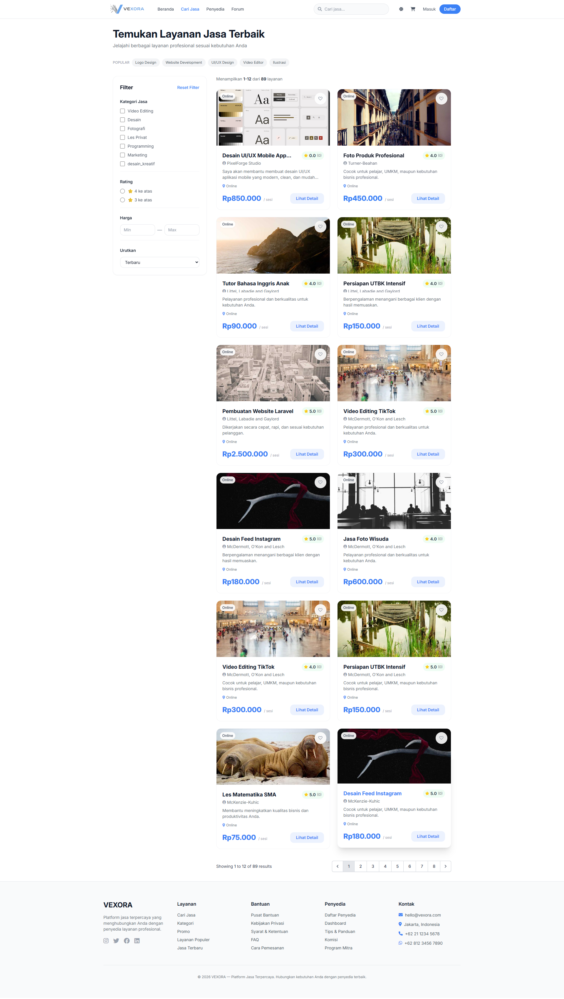
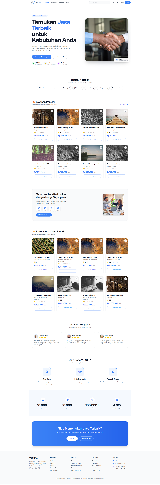

# VEXORA

VEXORA is a Laravel-based digital service marketplace designed to connect customers with trusted providers. The platform includes a modern catalog experience, service publishing for sellers, saved services and cart workflows, community discussions, and direct messaging between buyers and providers.

## Main Features

- Browse and search published services from a responsive catalog
- View detailed service pages and provider profiles
- Become a provider and publish/manage services from a seller dashboard
- Save favorite services and manage a shopping cart
- Contact the platform and participate in community forum discussions
- Start private conversations with providers through a built-in chat experience
- Access personalized dashboards for buyers and providers

## Technologies Used

- PHP 8.3
- Laravel 13
- Laravel Socialite for Google authentication
- Tailwind CSS
- Vite
- Alpine.js
- MySQL or SQLite-compatible database support

## Installation Guide

1. Clone the repository
   ```bash
   git clone <repository-url>
   cd Creativity-Innovation
   ```

2. Install PHP and Node dependencies
   ```bash
   composer install
   npm install
   ```

3. Create your environment file and configure the app
   ```bash
   cp .env.example .env
   php artisan key:generate
   ```

   If a `.env.example` file is not present, create a new `.env` file and set at least the following values:
   ```env
   APP_NAME=VEXORA
   APP_ENV=local
   APP_DEBUG=true

   DB_CONNECTION=sqlite
   DB_DATABASE=/absolute/path/to/database/database.sqlite

   GOOGLE_CLIENT_ID=your-google-client-id
   GOOGLE_CLIENT_SECRET=your-google-client-secret
   GOOGLE_REDIRECT_URI=http://localhost:8000/auth/google/callback
   ```

## Environment Setup

For a quick local setup using SQLite:

```bash
mkdir -p database
touch database/database.sqlite
php artisan key:generate
```

Then update your `.env` file with your preferred database connection.

## Database Migration

Run the migrations and seed the sample data:

```bash
php artisan migrate --seed
```

## Running the Application

Start the Laravel server and Vite development assets:

```bash
php artisan serve
npm run dev
```

Open http://localhost:8000 in your browser.

## Screenshots

The project includes visual assets under the public image folder. You can preview them here while preparing additional app screenshots:






## Demo Account

After running the seeders, you can sign in with a seeded user account:

- Email: any generated seeded user email
- Password: password

For a provider-focused experience, visit the dashboard and choose the option to become a provider, then publish services.

## Folder Structure

```text
app/                # Models, controllers, middleware, and service logic
config/             # Application configuration
database/           # Migrations, factories, and seeders
public/             # Static assets and public entry points
resources/          # Blade views, CSS, and JavaScript
routes/             # Web routes
tests/              # Feature and unit tests
```

## Author

Darren

## License

This project is licensed under the MIT License.
